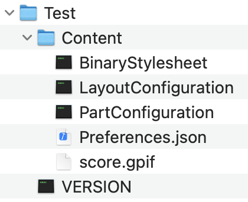

# music-notation-import

Import various music notation file formats into [music-notation](https://github.com/music-notation-swift/music-notation).

## Supported Formats
### Guitar Pro 7

Guitar Pro 7 is a zipped file format (`.gp`) which expands into a folder that has the following contents:

The `score.gpif` file is an application specific XML file.
The files in the GuitarPro7 folder are those specific to parsing this file format.

`music-notation-import` not supports specifying the `gpif` file alone, or specifying the container `gp` file. Using the [ZIPFoundation](https://github.com/weichsel/ZIPFoundation) the process will pull out the `score.gpif` file and parse that directly.

## Dependencies

- [SWXMLHash](https://github.com/drmohundro/SWXMLHash)
- [ZIPFoundation](https://github.com/weichsel/ZIPFoundation)
- [music-notation](https://github.com/music-notation-swift/music-notation)

## Notes

This is (obviously) a work in progress. It is meant to drive and help develop the `music-notation` project.
